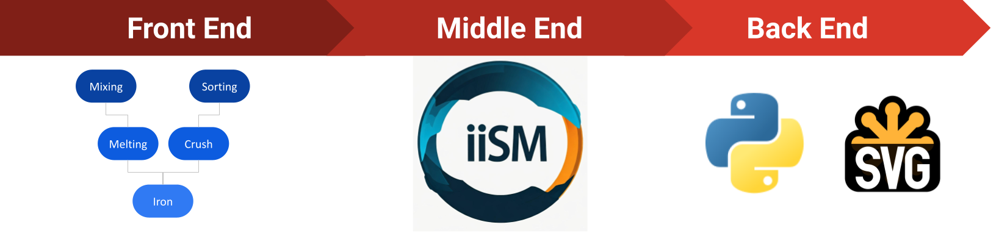
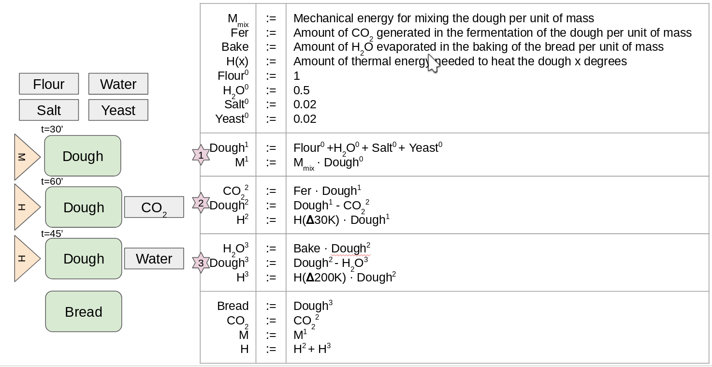

# IDR-IIsim

This README provides an overview of the Model IDR-IIsim within iDesignRES.  

It is handled by University of Deusto and part of WP1, Task number 1.4. 

## Purpose of the model  

The industrial sector is responsible for a large part of the energy, materials and emissions. Even as traditionally in the literature of energy system models, each industry has been modelled as a monolithic block, the energy consumption, emissions and materials used are not distributed uniformly across the different processes that each industry has to carry on. In this way, the impact of the industrial sector could change considerably if some of the processes are switched but others remain unavoidable. In order to assess this, a set of models to represent energy, materials and emission flows in industrial processes is developed here. The models are fast, accurate and produce results that could be integrated with large scale energy system models. 

## Model design philosophy  

The model developed here plans to go beyond global emission factors and build a set of models for each industrial process that could be mixed as needed to model a particular industrial sector including future processes that do not even have emissions factors. In contrast with the usual engineering models, which are usually based on a set of partial differential equations, the models required for this end should be simpler and faster to compute while attaining enough representativity of the industrial process modelled. 

For this end, we adopt a combination of different models:
  - The *Genetic Programming* philosophy to represent computer code: In this framework, a program (or model) is encoded as a tree or other similar structure where the mathematical relation between the components is represented. We use this philosophy to encode the relations between the different industrial processes in a way that is easy to write as computer programs that can be  easily manipulated from computer codes.
  - Use of *Recurrence Relations* to mathematically model each industrial process:  In order to model each industrial process we use recurrence relations. These mathematical objects are easily computable methods that keep the same expressivity as Ordinary Differential Equations or Partial Difference Equations.

The main advantage of this approach is that it allows the creation of a three stage compiler from a data model representing the relation between industrial processes and the mathematical representation of each process and a computer code in a computer language.
  - *Front End*: will read the data model and will perform syntactical checks (can all the processes be linked? Are they described correctly?, etc.) and produce an intermediate representation of the industrial process. 
  - *Middle End*: will read the mathematical description of each process and will optimize its representation (for example with constant propagation, simplification of mathematical formulas, solving or expanding recurrence relation, etc.). 
  - *Back End*: will take the intermediate representation and translate it to final code in a computer lenguaje. 

Please note that this philosophy allows us to use the same representation of the industrial process to produce code for different computer languages in an efficient way as only the back end has to be changed when porting the code from one language to another.

## Input to and output from the model  

It is needed to differentiate between the input and output of the compiler to the inputs and outputs of the models produced. 
  - *Compiler*: the compiler will take as input a description of the industrial processes in a YAML file (following a data model described here)  and produce Python code as output. For example, the figure below shows a block diagram of the industrial process to produce bread. This block diagram with equations can directly be transcribed to a set of YAML files describing the 3 industrial processes involved. These files can be passed through the compiler and produce a Python library  ready to import in your model. 
  - *End industrial models*: the input for these models will be the industrial production in the relevant units (for example tons of steel, number of breads, liters of ammonia, etc.). The output of these models will be the materials needed to produce the industrial output, the energy consumed and the emissions. Below can be seen an image representing the bread production. The input will be the tons of bread needed to produce and the model will give the CO2 and energy consumed (divided in Mechanical and Heat).

## Implemented features  

At the moment the following features are present in the compiler:
Python and svg back ends are available. 
  - The data model only allows constant recurrence equations (so the model is not taken into consideration the time variable at the moment). 
  - The optimization does simple constant propagation and rewrite mathematical formulas to reduce the amount of operations. 

Moreover, preliminary model of the following industries are included in the repository:
  - Cement industry
  - Steel production
  - Food industry

We are currently working on including more process of these industries as well as in including models for the following industries:
  - Wastewater treatment plants
  - Manufacturing
  - Pulp and paper industry
  - Fashion industry
  - Data centers

Finally, we have not included at the moment any process to produce the energy requirements or methods to capture and reuse emissions or waste. 

## Core assumption  

At the moment, several general assumptions have been made in the description of the industries: 
  - Only constant linear models of the process are included at this point. In next versions it is expected to include time variable ramps and non linear descriptions of models when they make sense.
  - The constants used to fit each industrial process came from very different sources. It is advised to read the documentation of each process to assess the suitability of the constants before extrapolate values with the model produced. 
  - The model does not include economy of scale and assumes the input needs scale linearly with the required outputs.

Please note that each industrial process has its own set of assumptions that are described in each of the YAML files. 

## Repository (Remove this part if the model is uploaded in this repository and you don't want to refer to an external repository) 

The repository for IDR-IIsim could be found at [https://github.com/DeustoTech/IDR-IIsim](https://github.com/DeustoTech/IDR-IIsim)
